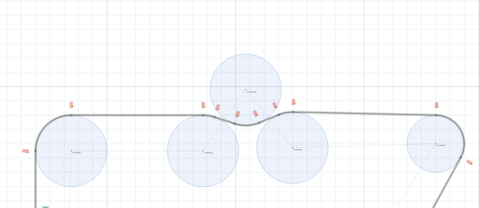
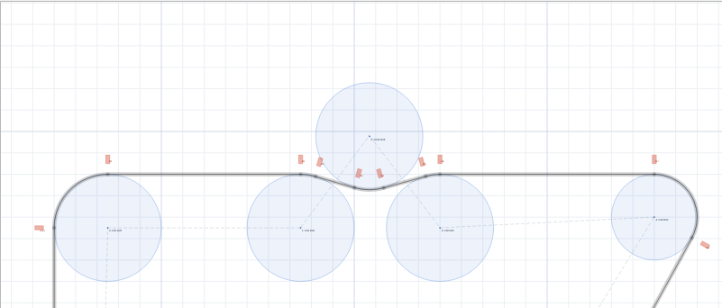
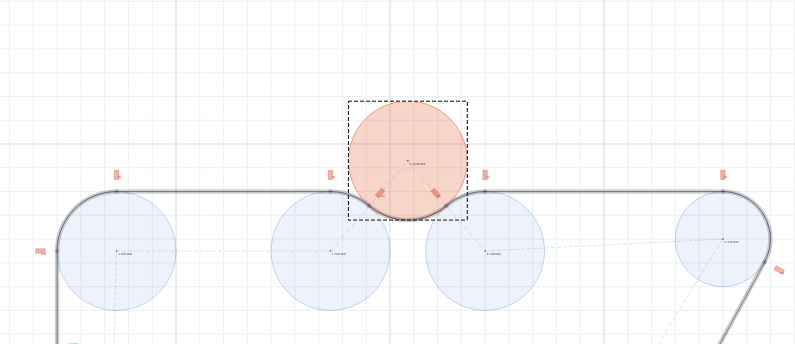
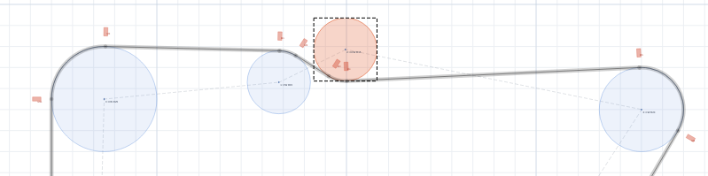
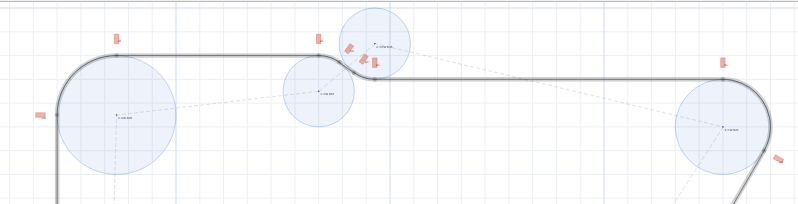
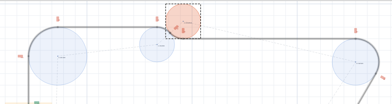
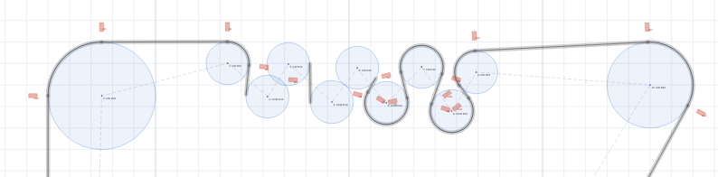
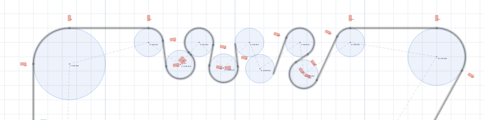
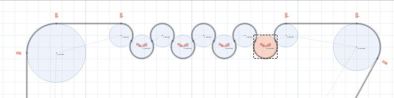

# コース設計のTips

## シケインの設計
1. 3つの補助円をそれっぽく配置する。

2. 1・3番目の補助円の座標を正確に設定する(座標を整数にしておくと実際のコース製作が楽)。

3. 2番目の補助円を選択し、Fit Touch ボタンを押すことにより、2番目の補助円が1・3番目の補助円に接するように調整する。

## S字コーナーの設計
1. 2つの補助円をそれっぽく配置する。

2. 両方の補助円の座標を正確に設定する (シケインの場合と異なり、1つの円に接する円は一意に定まらないため、両方の円の座標をできる限り正確に設定した方がよい)。

3. どちらか片方の補助円を選択し、Fit Prev または Fit Next ボタンを押すことにより、2つの補助円が接するように位置を調整する。
4. xy座標のうちどちらか片方を一定の値に固定したい場合、固定したい座標を再度設定し、3. を行う、という手順を繰り返すことにより、片方の座標を固定したままもう片方の座標を調整することができる。

## 蛸壺の設計 (左右カーブの連続も同様)
1. 補助円をそれっぽく配置する。

2. 奇数番目、あるいは偶数番目の補助円の座標を正確に設定する。たとえば2015全日本のR10蛸壺を再現したい場合、奇数番目(あるいは偶数番目)の補助円を35cm間隔で配置するとよい。

3. 2.で座標を設定していない補助円について Fit Touch ボタンを用いて位置を調整する。
